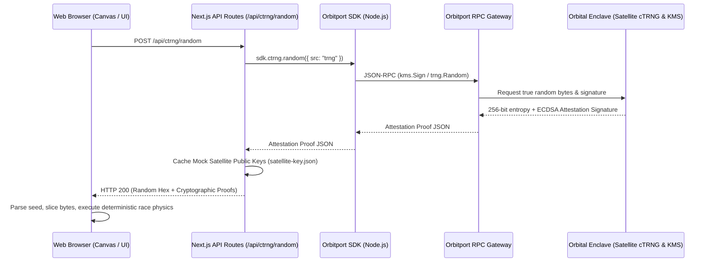

# Cosmic Speedway: Verifiable Developer Lab & Orbitport cTRNG Demo

Cosmic Speedway is a developer-focused, high-fidelity demonstration of [SpaceComputer's Orbitport cTRNG](https://docs.spacecomputer.io) (Cosmic True Random Number Generator) and KMS (Key Management Service). 

The application showcases how true cosmic radiation entropy, harvested by orbiting satellites, is used to drive deterministic, provably fair gameplay on a HTML5 canvas space speedway.

---

## 🛰️ System Architecture

Cosmic Speedway uses a hybrid client-server model to protect API credentials while exposing complete cryptographic proof metadata to the frontend.



---

## 🛠️ Key Developer Features

1. **Satellite Enclave Verification:** Interactive "Attestation Proof" developer console displaying raw JSON payloads, KMS signatures, and verification statuses.
2. **Deterministic Racing Math:** Spaceship speeds, active upgrades, overtaking wobbles, and final placements are computed using modulo math on specific slices of the 256-bit seed.
3. **Dual Execution Modes:**
   - **API Mode:** Requires credentials. Fetches live, signed entropy directly from the orbital satellite enclave.
   - **IPFS Beacon Mode:** Public fallback. Fetches the latest 60-second IPNS beacon block and hashes it with the KMS signing key for local dynamic entropy.
4. **Vector Speedway Renderer:** High-performance, 60 FPS HTML5 Canvas engine rendering a laser speedway with scrolling holographic grids, neon glowing guides, and active particle accelerators.

---

## 📦 Directory Structure

```text
orbitport-playground/
├── src/
│   ├── app/
│   │   ├── api/
│   │   │   ├── beacon/latest/route.ts  # Fetches IPFS beacon block
│   │   │   └── ctrng/random/route.ts   # Calls Orbitport API with credentials
│   │   ├── layout.tsx                  # Root metadata & font imports
│   │   ├── page.tsx                    # Main canvas engine & dashboard GUI
│   │   └── globals.css                 # Global stylesheets & neon glows
│   ├── components/
│   │   ├── proof-panel.tsx             # Interactive cryptographic verification UI
│   │   ├── copy-button.tsx             # Developer snippet copying utility
│   │   └── status-badge.tsx            # Live API/IPFS state indicator
│   └── lib/
│       ├── orbitport.ts                # OrbitportSDK constructor wrapper
│       ├── verify-signature.ts         # ECDSA secp256k1 signature verification
│       └── kms-helper.ts               # Fallback KMS hashing helpers
├── public/
│   └── game-assets/                    # Transparent PNG spacecraft & track tiles
├── satellite-key.json                  # Mock public key enclave cache
└── README.md                           # Developer reference manual
```

---

## 🚀 Quick Start

### 1. Install Dependencies
```bash
npm install
```

### 2. Configure Environment Variables
Copy the template file:
```bash
cp .env.example .env.local
```

Configure credentials (optional):
```ini
ORBITPORT_CLIENT_ID=your_client_id
ORBITPORT_CLIENT_SECRET=your_client_secret
ORBITPORT_API_URL=https://op.spacecomputer.io
```

*If credentials are left empty, the application falls back automatically to the public **IPFS Beacon Mode**.*

### 3. Start Development Server
```bash
npm run dev
```
Open [http://localhost:5669](http://localhost:5669) in your browser.

---

## 📡 API Endpoints

### `POST /api/ctrng/random`
Requests 256 bits of cosmic entropy.

**Sample Response (API Mode - Signed):**
```json
{
  "success": true,
  "randomHex": "5f3a9e...",
  "source": "trng",
  "service": "Orbitport cTRNG API",
  "timestamp": 1781223940000,
  "requestId": "req-9a3b8c...",
  "provider": "SpaceComputer Satellite Enclave",
  "signature": {
    "value": "3045022100e4...",
    "pk": "04b5c7...",
    "algo": "ECDSA (secp256k1)"
  },
  "ctrngVerified": true
}
```

---

## 💻 Integration Code Snippets

### 1. Fetch Randomness via Orbitport SDK (TypeScript)
```typescript
import { OrbitportSDK } from "@spacecomputer-io/orbitport-sdk-ts";

const sdk = new OrbitportSDK({
  config: {
    clientId: process.env.ORBITPORT_CLIENT_ID,
    clientSecret: process.env.ORBITPORT_CLIENT_SECRET,
    apiUrl: process.env.ORBITPORT_API_URL || "https://op.spacecomputer.io"
  }
});

async function getCosmicSeed() {
  const response = await sdk.ctrng.random({ src: "trng" });
  return response.data.randomHex; // 64-character hexadecimal string
}
```

### 2. Verify Satellite Signature Locally (Node.js)
```typescript
import * as crypto from "crypto";

export function verifySatelliteSignature(
  randomHex: string,
  signatureHex: string,
  publicKeyHex: string
): boolean {
  try {
    const verifier = crypto.createVerify("sha256");
    verifier.update(Buffer.from(randomHex, "hex"));
    
    return verifier.verify(
      Buffer.from(publicKeyHex, "hex"),
      Buffer.from(signatureHex, "hex")
    );
  } catch (err) {
    console.error("Signature verification failed:", err);
    return false;
  }
}
```

---

## 🧮 Mathematical Determinism Proof

To guarantee that the front-end layout is fully provable and immune to execution tampering, spaceships are simulated deterministically using modulo slicing on the cosmic seed:

```typescript
// Slicing the 256-bit (64 hex characters) seed into four 16-character chunks
const seed = "5f3a9e8b7c6d5e4f3a2b1c0d9e8f7a6b5c4d3e2f1a0b9c8d7e6f5a4b3c2d1e0f";

const carVariables = CAR_NAMES.map((_, idx) => {
  // Extract 64-bit slice (16 hex chars = 8 bytes)
  const slice = seed.slice(idx * 16, (idx + 1) * 16);
  const val = BigInt("0x" + slice);

  // Derive specs deterministically
  const boostTime = 0.3 + Number(val % 40n) / 100; // Trigger threshold
  const boostAmount = 0.03 + Number(val % 5n) / 100; // Acceleration delta
  
  return { boostTime, boostAmount };
});
```
This guarantees that **the winner is determined at the instant the seed is generated**, and the front-end animation is simply a graphical replay of the cryptographically sealed result.
